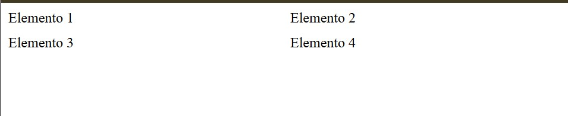
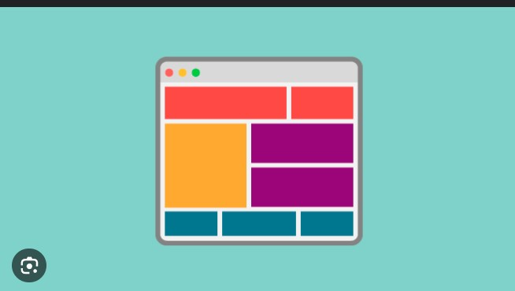

# Introducción a CSS Grid

**CSS Grid** es una herramienta poderosa de CSS que nos permite crear **diseños web en forma de cuadrícula (grid)** de manera muy flexible. A diferencia de otros métodos como `float`, `flexbox` o `position`, **Grid está diseñado especialmente para organizar elementos en filas y columnas**, lo que lo hace ideal para construir estructuras completas de páginas web.

---

## ¿Qué es una grid?

Una **grid** es una especie de *"tabla invisible"* que nos ayuda a posicionar elementos dentro de un contenedor. Podemos decidir **cuántas filas y columnas** queremos, y luego **colocar los elementos exactamente donde queramos** dentro de esa cuadrícula.

---

## ¿Por qué usar CSS Grid?

✅ Permite **dividir una página en secciones** de manera ordenada.  
✅ Puedes **alinear elementos fácilmente** tanto en filas como en columnas.  
✅ Hace que el diseño sea **más limpio y fácil de mantener**.  
✅ Es **responsivo**, lo que significa que se adapta bien a distintos tamaños de pantalla.

## "Flexbox es para una dimensión, Grid es para dos."

Ejemplo básico:
```css
.container {
  display: grid;
  grid-template-columns: 1fr 1fr;
  grid-template-rows: auto;
  gap: 10px;
}
```
```html
<div class="container">
  <div>Elemento 1</div>
  <div>Elemento 2</div>
  <div>Elemento 3</div>
  <div>Elemento 4</div>
</div>
```


 Explicación:
display: grid;
Esto convierte el contenedor .container en una grid, activando todas las propiedades relacionadas.

grid-template-columns: 1fr 1fr;
Define dos columnas de igual tamaño.

1fr significa "una fracción del espacio disponible".

Entonces, 1fr 1fr reparte el ancho total del contenedor en dos partes iguales.

grid-template-rows: auto;
Esto crea una sola fila que se adapta automáticamente al contenido de los elementos.

gap: 10px;
Define un espacio de 10 píxeles entre todas las filas y columnas de la grid (separación interna).

## Otras formas de hacerlo:
 A. Usar repeat() para simplificar columnas:
```css
grid-template-columns: repeat(2, 1fr);
```
Significa: "Repite dos veces 1fr".
Con puedes personalizar el número de columnas, filas, tamaños y espacios según tus necesidades. Es como jugar con bloques de construcción para diseñar la web

B. Definir tamaños fijos:
```css
grid-template-columns: 200px 1fr;
```
 Primera columna de 200px, segunda columna toma el resto del espacio disponible.

 C. Crear múltiples filas:
```css
grid-template-rows: 100px auto;
```
 La primera fila tendrá 100px de alto, y la segunda se ajusta al contenido.

 dale un vistazo al ejemplo de grid antes de continuar con el ejercicio:


replica esta imagen usando grid